**When we are solving computational problems, we usually have almost unlimited possibilities to write and organize our code. The number of possible solutions is only limited by our own creativity. However, the goal is often not the most creative solution, but the most efficient one.  Especially, when I write code to analyze massive amounts of data, I want to it to do the job as efficient as possible.  
In order to optimize some of my Python code, I analyzed the efficiency of different approaches to solve similar problems, which I want to share with you in this article.**

#### Overview

  

		

[About the measurement approach](#approach)  
[Adding elements to dictionaries](#dictionary)  
[Filtering lists via conditional statements](#list_condition)  
[Creating lists using function calls](#list_func)  
[Concatenating strings](#string_conc)  
[Assembling strings](#string_assembly)  

  

		

## About the measurement approach
Before I move on to use some sophisticated tools for a deeper code performance analysis, e.g., via Pythons profiling tools `cProfile` and `profile` [http://docs.python.org/2/library/profile.html](http://docs.python.org/2/library/profile.html), I performed a more traditional analysis here.  
For every question I raised, I wrote a scaffold script to calculate the cpu time that is required to perform a certain task over *n* iterations. Then I swapped in the significant lines of code to be evaluated into the cpu-time measurement scaffold script and ran the test 3 times. 
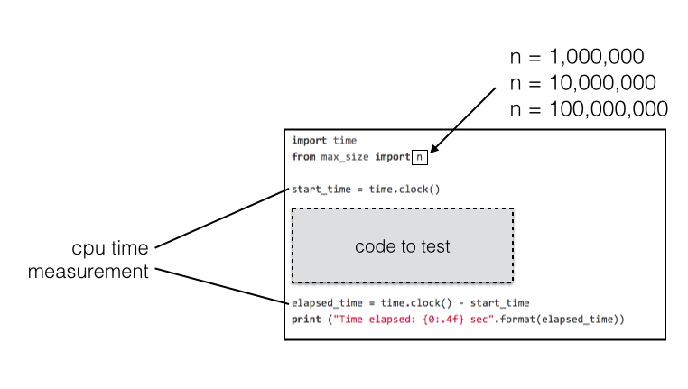
I collected cpu times for all scripts in a set before I increased the value of *n* (i.e., the number of iterations) by a factor of 10. Eventually, I ended up with 9 data points for each individual script: 3 repetitions for each of the three values of *n* iterations.
Next, I calculated the mean and variance for each series of measurements for each value of *n*; the results are plotted in the respective line and bar plots in Python using the [matplotlib](http://matplotlib.org/) module.
The line plots are showing the mean cpu times for each script for the 3 different values of *n* (iterations). And for the bar plots I calculated the fold-differences of the mean cpu times relative to the slowest script in a set. The error bars in the line and bar plots are resembling the *variances* of the measurements.  
The figure below summarizes how the data would look like for the particular case of the pair of scripts `string_conc_1.py` and `string_conc_2.py`.
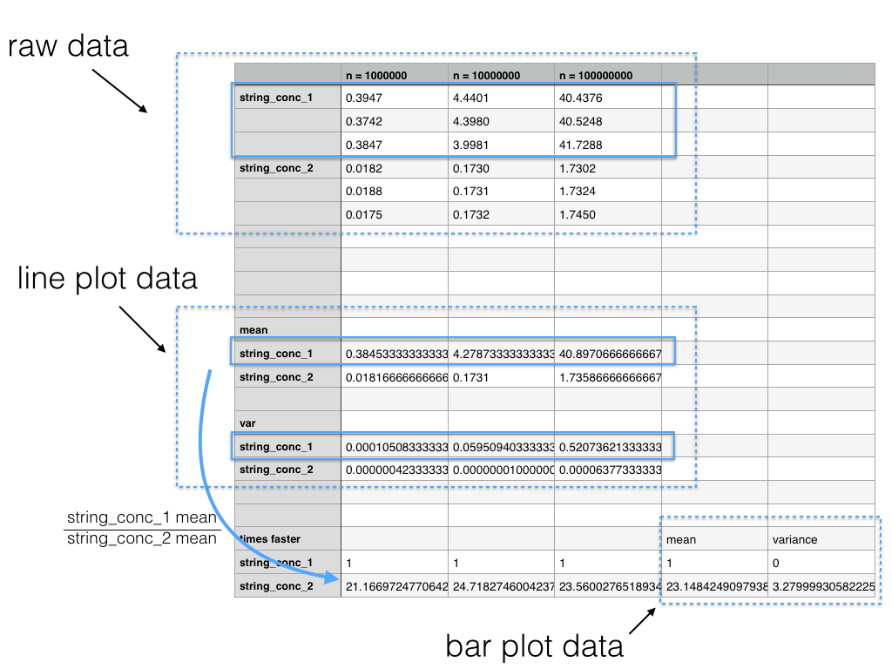

Eventually, I want to mention the machine I was using for those measurements:

  

		
**System Specifications:**  
Model Name: Mac mini (Mid 2010)  
Processor Name: Intel Core 2 Duo  
Processor Speed: 2.4 GHz  
Number of Processors: 1  
Total Number of Cores: 2  
L2 Cache: 3 MB  
Memory: 8 GB 1067 MHz DDR3    
Bus Speed: 1.07 GHz  

Operating System: Mac OS X 10.9.1  
Python version: 3.3.3  

  

		

I deposited everything, including the test scripts, plotting scripts, images, and data sheets on GitHub. Please feel free to use the code to replicate the analyses on your machine, or to modify the code for further analyses.  
[https://github.com/rasbt/python_efficiency_tweaks](https://github.com/rasbt/python_efficiency_tweaks)

## Adding elements to dictionaries
It was a question that always interested me: "What is the most efficient way to add elements to an existing dictionary?" To get to the bottom of the situation, I used a Python dictionary structure with 1-letter strings as keys. The associated values were integers that were used to count how often those 1-letter strings occurred in a different data structure.  
For a real-world example: Imagine you want to count web site traffic where the dictionary keys resemble the website's addresses, and the count (i.e., the associated dictionary value) is incremented by 1 each time a user visits this particular site.  

In contrast to other languages (e.g., C++), Python throws an error when you try to access a dictionary element via the `[]` element-access-operator if the key does not exist, yet. Thus, we have to check if a key already exists in the Python dictionary before we attempt to increment its count. When I wrote the Python code, I could think of at least 2 reasonable approaches: The first script (`init_dict_1.py`) is using a simple if-statement to check whether a dictionary key already exists; if the if-statement evaluates to `False`, the key will be added to the dictionary before the count will be incremented by 1. The second script (`init_dict_1.py`) will brazenly `try` to increment the key's count by 1 whether it exists or not. By exploiting thrown `KeyError` exceptions via an `try-except` loop, it adds keys to the dictionaries if they don't exist yet.  
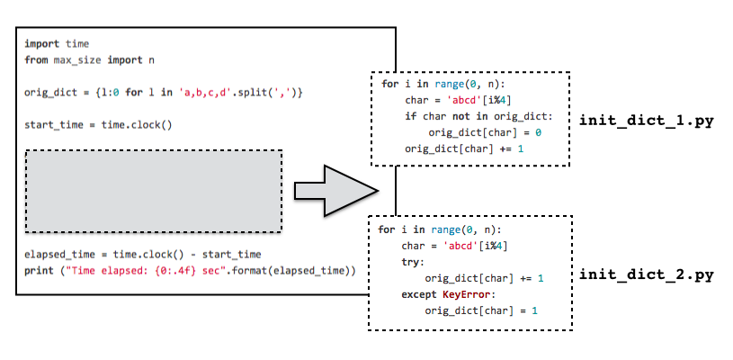

So, what this code will actually do is initiating a dictionary with the letters a, b, c, d as keys and their count (i.e., the key-associated value) set to 0. The structure (`orig_dict`) would look like this:  
`{'a': 0, 'b': 0, 'c': 0, 'd': 0}`  
Then, it will loop *n* times (where n=1,000,000, n=10,000,000, or n=100,000,000)  over the characters a,b,c, and d, and increase the respective dictionary  value by 1, which represents the count for this character.
For n=1,000,000, for example, the resulting dictionary would look like this:  
`{'a': 25000, 'b': 25000, 'c': 25000, 'd': 25000}`  
The performance of those two approaches are shown in the plots below.
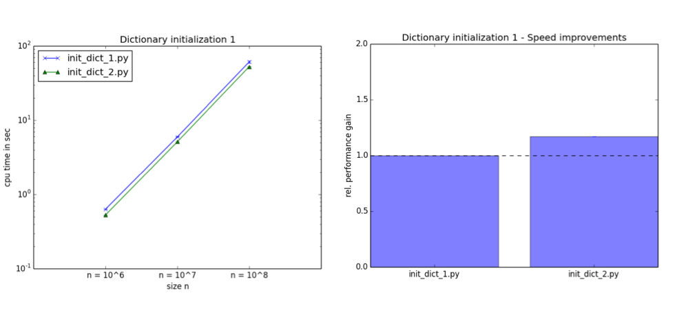
So, for this particular case, a `try-except` loop seems to be ~ 1.2x faster than the if-statement checking for existing elements. This result is quite intuitive, since all dictionary keys, which's value we want to increment, already exist.  
The next question is how the `try-except` loop fares if new elements have to be added to the dictionary? Here, I assume the extreme case of an empty dictionary where all elements to be counted are no dictionary keys, yet. 
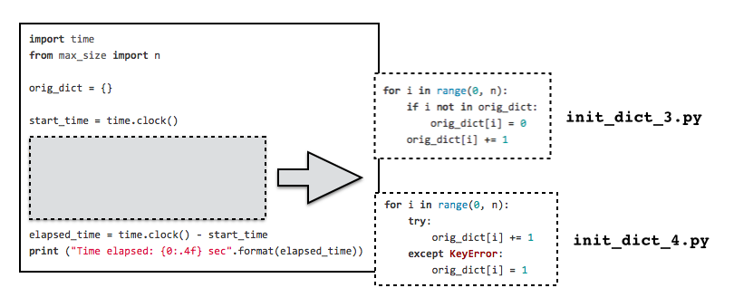

As you can see it in the plots above, the `if-statement` check for existing dictionary elements (`init_dict_3.py`) is suddenly ~ 1.4x faster than the `try-except` loop.
Note that these are some extreme cases where all keys are already existing in the dictionary (`init_dict_1.py` and `init_dict_2.py`), or where none of the keys exists in the dictionary, yet  (`init_dict_3.py` and `init_dict_4.py`). In real-world applications we'd usually have something in between: Some dictionary keys are already present, some have to be added to the data structure before we can start to increment their counts.   
In future tests I want to investigate those intermediate cases in more detail in order to deduce the threshold of existing dictionary keys that would make a `try-except` loop over an `if-statement` check for existing dictionary keys pay-off.

## Filtering lists via conditional statements
In this test, I attempted to figure out the fastest way to create a new list of elements that meet a certain criterion. For the sake of simplicity, the criterion was to check if an element is even or odd, and only if the element was even, it should be included in the list. For example, the resulting list for numbers in the range from 1 to 10 would be [2, 4, 6, 8, 10].  
Here, I tested three different approaches:  	
1) a simple for loop with an `if-statement` check (`list_compr_1.py`)  
2) a list comprehension (`list_compr_2.py`)  
3) the built-in `filter()` function (`list_compr_3.py`)  
Note that the `filter()` function now returns a generator in Python 3, so I had to wrap it in an additional `list()` function call.  

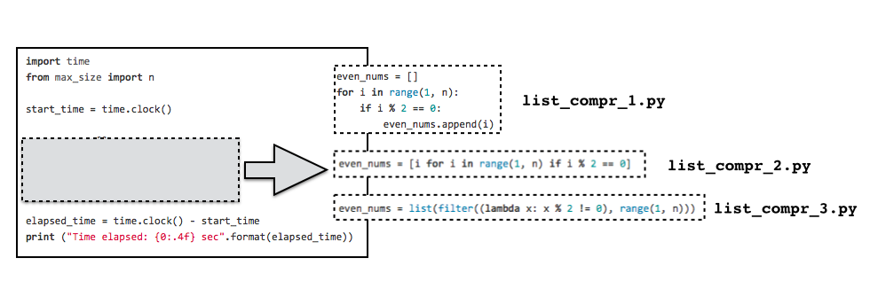
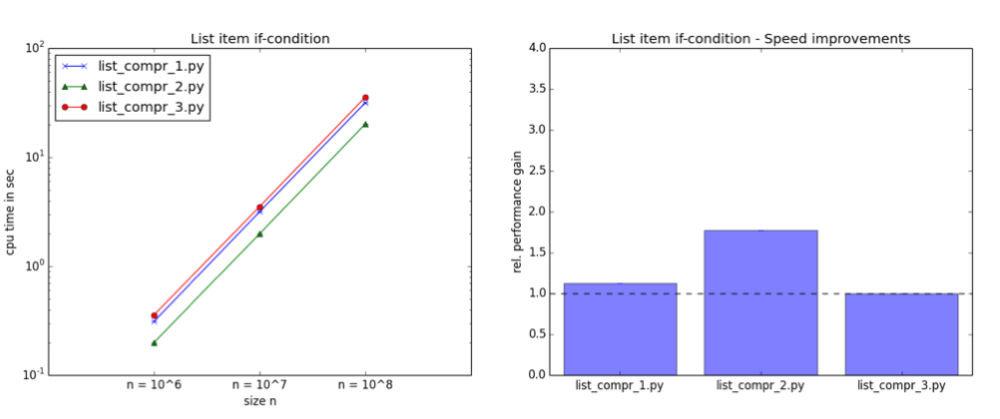

We can see in the plots above that the `list()` function is the slowest of those three approaches. This might be due to the additional generator-to-list conversion via the `list()` function call, but this is something I have to investigate in future experiments using Python 2.7. The simple `for` loop with an `if-statement` check is ~ 1.2x faster than the filter function, and the list comprehension outperforms the `list()` function even more significantly (~ 1.8x faster).  
However, the bottom line of this experiment is that a list comprehension can not only make your code look more compact for creating simple lists  (mathematicians would even claim it will become easier to read), but it also boosts computational performance.

## Creating lists using function calls
We have seen in the previous section that list comprehensions are a fast way to create lists by filtering. The question here is also about the optimal way to create lists, but instead of using an `if`-statement check to filter for values, I was interested in the list creation via function calls. The particular code I was using for this test simply calculates the length of the string "abc" *n*-times and collect the results in a list. A more realistic application, for example, could be the screening through New York Times articles to calculate the average word count per article.  Anyway, the three approaches I wanted to compare are:  
1) a simple `for-loop` with an embedded function call that appends elements to a list (`list_func_1.py`)  
2) a list comprehension (`list_func_2.py`)  
3) the in-build `map()` function (`list_func_3.py`)  
The `map()` function is related to `filter()`, which we have seen in previous section. But where `filter()` expects an function that evaluates to `True` or `False` in order to apply filtering to input-elements, `map()` will simply collect the `return`s of a function in a list.

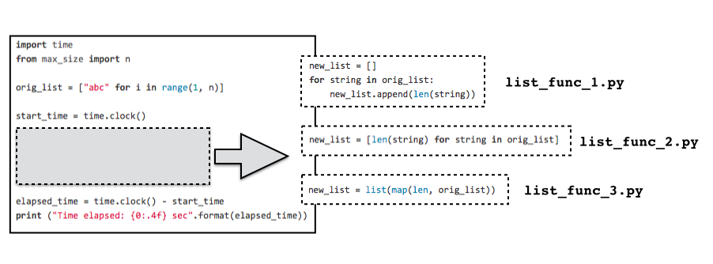
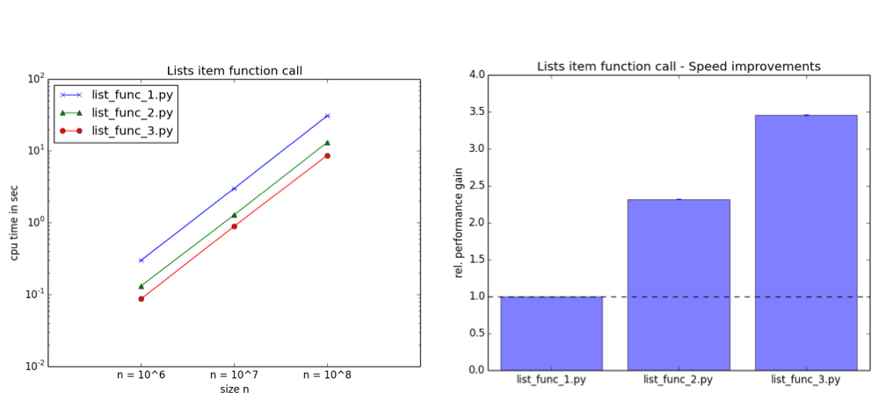

Consistent with the expectation that we raised based on the previous section, we see that list comprehensions are performing faster than the classic `for-loop` approach (here: `list_func_1.py` was ~2.3 x faster than `list_func_2.py`). However, this time the in-built function call (i.e., `map()`) was the superior approach. It performed ~ 3.4x faster than the `for-loop`, and ~ 1.5x faster (results not shown in the plot) than the list comprehension.  

So the bottom line of this analysis is that list comprehensions are ideal to create lists using simple evaluations via `if-statements`, and the in-built `map()` is the way to go for creating lists via function calls.  

## Concatenating strings
Strings in Python are immutable objects. So, each time we append a character to a string, it has to be created "from scratch" in memory. Thus, the answer to the question "What is the most efficient way to concatenate strings?" is a quite obvious, but the relative numbers of performance gains are nonetheless interesting.  
The two approaches I compared, are  
1) string concatenation via the `+` operator (`string_conc_1.py`)  
2) string concatenation via the `.join()` method (`string_conc_2.py`)  

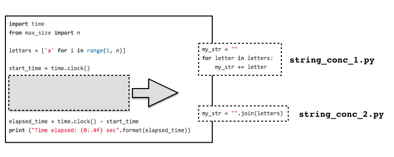
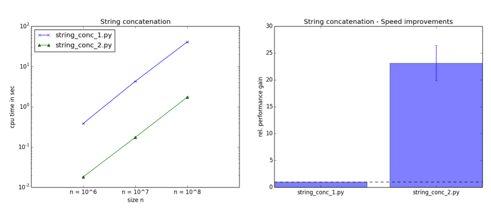

Let the results speak for themselves: The `.join()` method is ~ 23x faster than the usage of the `+` operator to concatenate strings!

## Assembling strings
Next, I wanted to compare different methods string "assembly." This is different from simple string concatenation, which we have seen in the previous section, since we insert values into a string, e.g., from a variable.  
The three approaches are using  
1) the `+` operator (`string_subst_1.py`)  
2) the `format()` method (`string_subst_2.py`)  
3) the classic `%` string formatting operator (`string_subst_3.py`)  

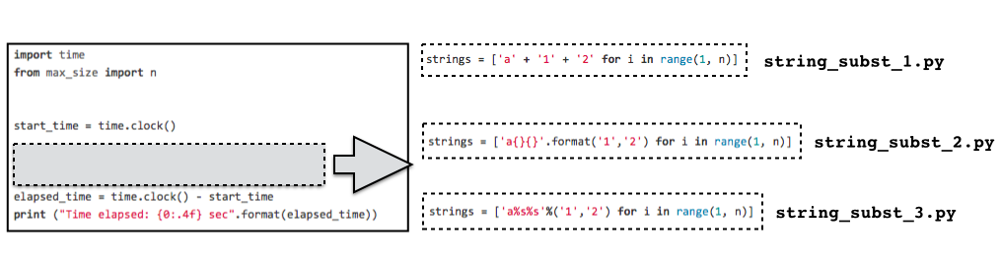
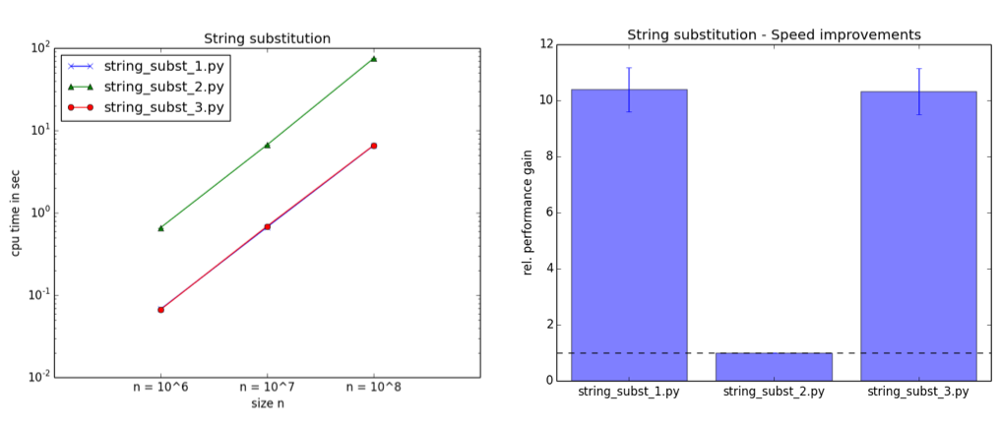

The results indicate that the `format()` function is by far the slowest of those three approaches (here, the two other approaches are ~ 10x faster). 
I express my surprise as I expected a similar performance from the `.format()` method and the `%` operator; especially surprising, since the `%` operator is considered as deprecated in Python 3. 
Eventually, I went back to the editor, double-checked my scripts, and reproduced the data multiple times; I still can't explain this observation. Thus, I encourage you to download the [scripts](https://github.com/rasbt/python_efficiency_tweaks/test_code) and try it on your machine using Python 3.3.3 (or different versions of Python). Please let me know what results you get, I am really curious!
